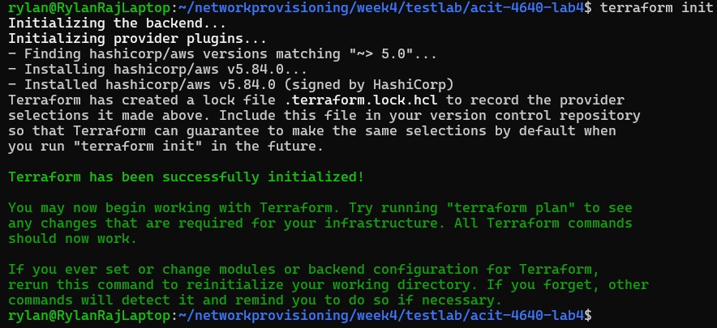
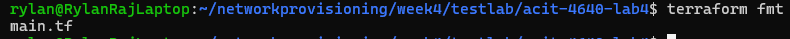
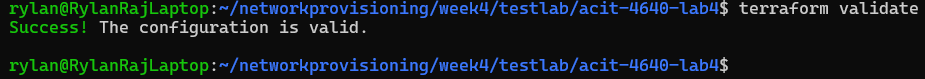
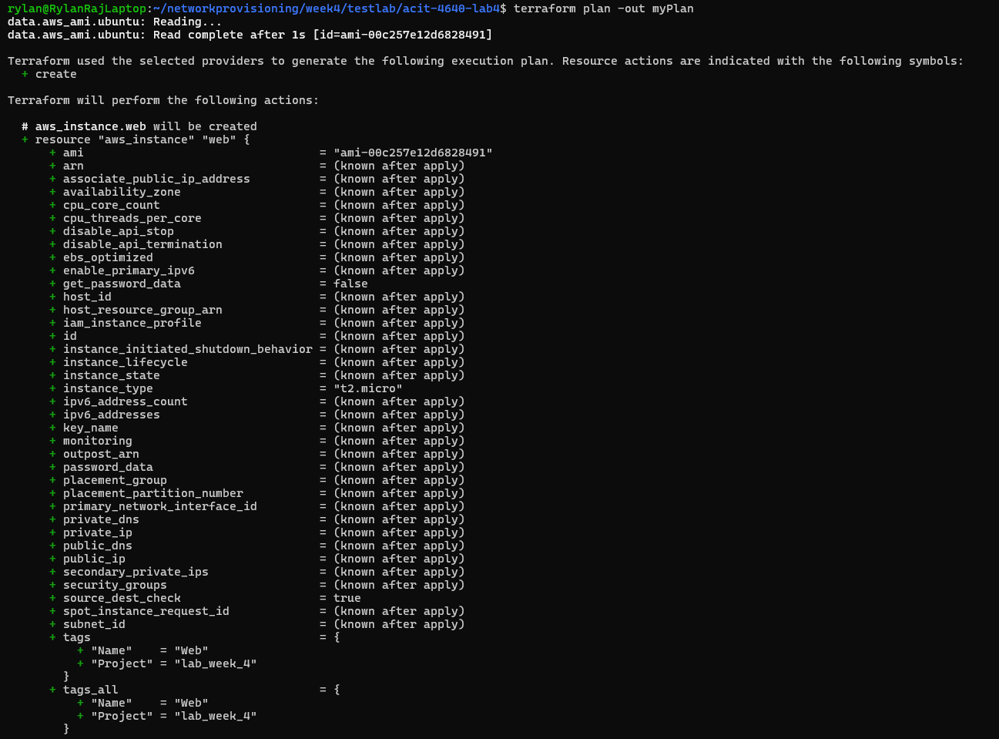
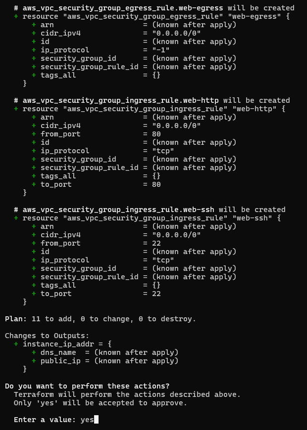
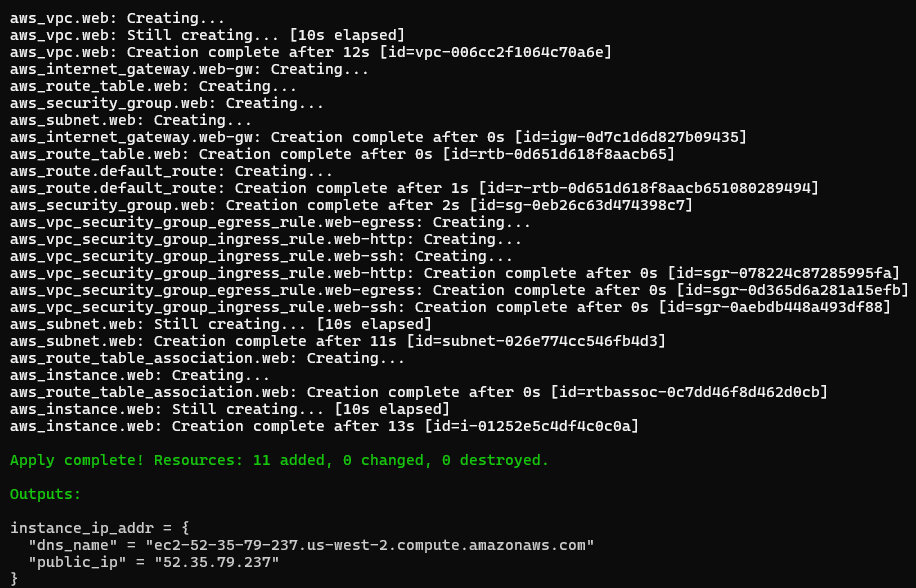
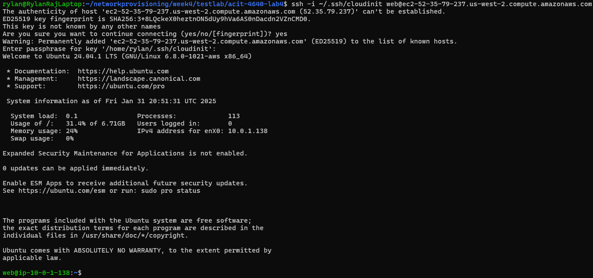
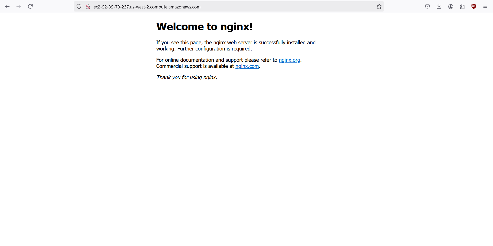
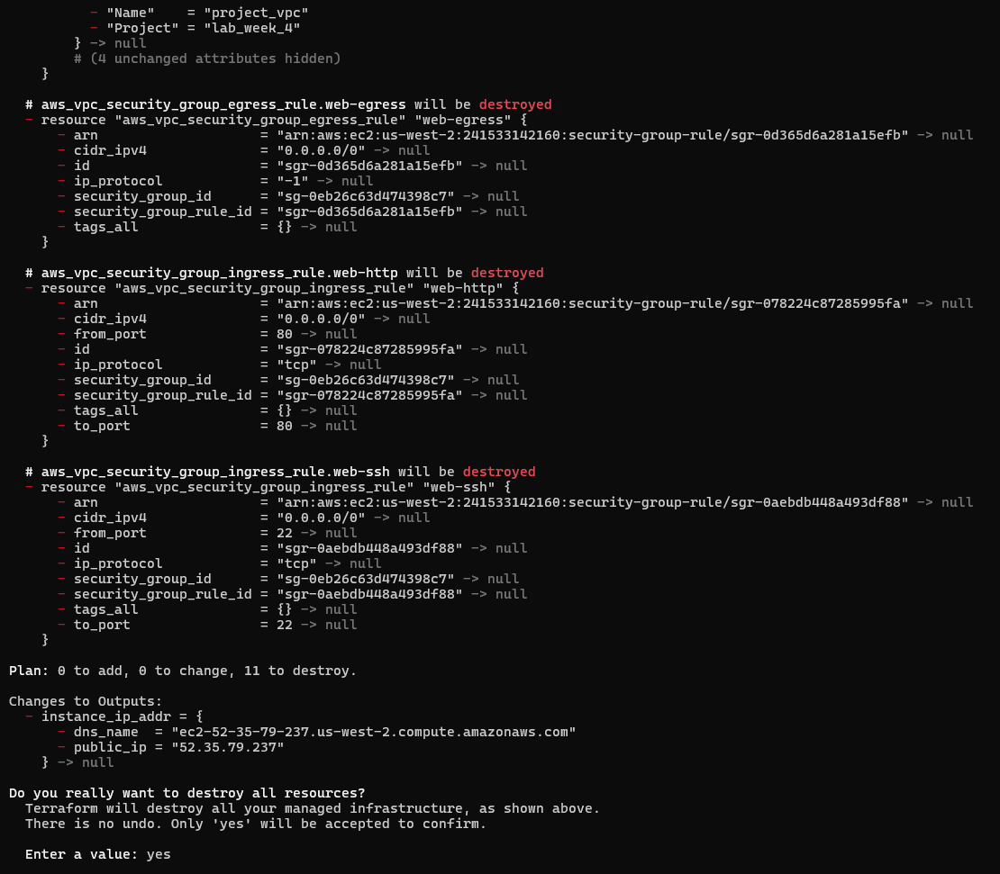

# Lab Week 4 Instructions

**Note:** You don’t have to use vim, you could use whatever text editor you like

First make sure you have Terraform installed

```bash
# get gpg keys to identify the hashicorp developers who maintain the repo
wget -O - https://apt.releases.hashicorp.com/gpg | sudo gpg --dearmor -o /usr/share/keyrings/hashicorp-archive-keyring.gpg

# add repo to list of package repositories
echo "deb [arch=$(dpkg --print-architecture) signed-by=/usr/share/keyrings/hashicorp-archive-keyring.gpg] https://apt.releases.hashicorp.com $(lsb_release -cs) main" | sudo tee /etc/apt/sources.list.d/hashicorp.list

# update repositories and install Terraform
sudo apt update && sudo apt install terraform
```

Create a new ssh pair using the following command

```bash
ssh-keygen -t ed25519 -f ~/.ssh/<your-key-name> -C "<comment-to-identify-key>"
```

Copy the contents in the public key

```bash
cd ~/.ssh
vim <your-key-name>.pub
```

Paste them in the **cloud-config.yaml** file under ssh-authorized-keys

```bash
# cd back to where ever you cloned the repository and into the scripts directory
vim cloud-config.yaml

#cloud-config
users:
  - name: web
    primary_group: web
    groups: wheel
    shell: /bin/bash
    sudo: ['ALL=(ALL) NOPASSWD:ALL']
    ssh-authorized-keys:
      - # PASTE HERE AND REMOVE THIS COMMENT

package_update: true
package_upgrade: true
packages:
  - nginx
  - nmap
```

Get out of the scripts directory and change **main.tf**

```bash
cd ..
vim main.tf
```

Change the aws region and profile specific to your AWS account

```bash
# configure version of aws provider plugin
# https://developer.hashicorp.com/terraform/language/terraform#terraform
terraform {
  required_providers {
    aws = {
      source  = "hashicorp/aws"
      version = "~> 5.0"
    }
  }
}

# Configure the AWS Provider
provider "aws" {
  region = "us-west-2" # CHANGE LINE
  profile = "rylan-sandbox" # CHANGE LINE
}
```

You also may have to perform aws sso login so that the AWS cli can access your account’s profile

```bash
aws sso login --profile your-profile
```

Run Terraform commands

```bash
terraform init
terraform fmt
terraform validate
```

It should look like this:







If validate works, proceed to preview the infrastructure that will be created

```bash
terraform plan -out myPlan
```



Execute the plan if you’re okay with the actions Terraform will perform

```bash
terraform apply
```

Say yes when prompted to create the resources





You should now be able to ssh to access the shell of the EC2 instance.

Copy the public_ip or dns_name that was displayed and run:

```bash
ssh -i ~/.ssh/YOUR_PRIVATE_KEY web@YOUR_DNS_NAME
```

My example will not work for you, it is just reference



Also, if you go to your DNS or Public IP you will see the nginx welcome message 



This is the end of the instructions, you can destroy all the infrastructure if you’d like with:

```bash
terraform destroy
```

Say yes when prompted


